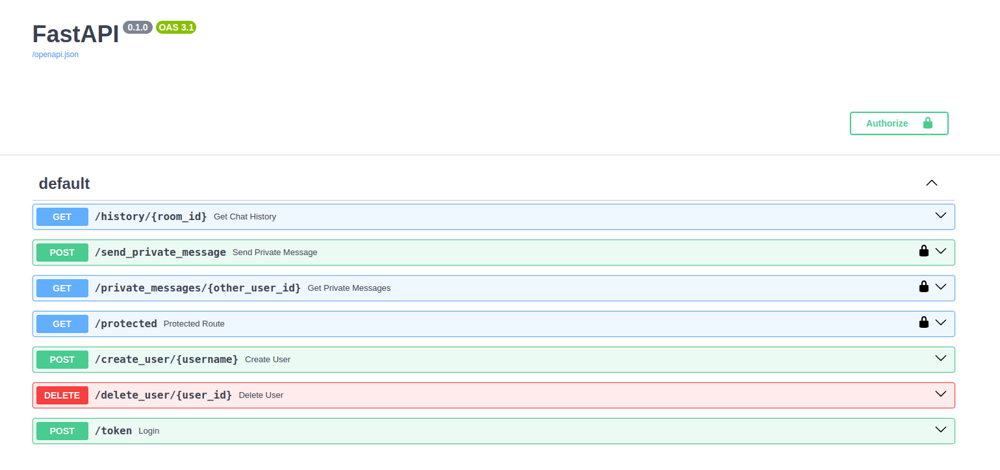

# FastAPI Chat App with WebSockets

A real-time chat application built using FastAPI and WebSockets. This project provides a simple and extensible foundation for creating chat applications with authentication, private messaging, and WebSocket communication.



## Features

- **FastAPI**: Utilizes the FastAPI framework for building APIs with Python 3.7+ type hints.
- **WebSocket Chat**: Real-time chat functionality using WebSockets for instant message updates.
- **User Authentication**: Secure user authentication with OAuth2PasswordBearer and JWT tokens.
- **Private Messaging**: Ability to send and receive private messages between users.
- **SQLite Database**: Persistence layer using SQLite for ease of deployment and testing.
- **Scalable and Extendable**: Designed for easy extension and customization based on your chat application needs.

## Getting Started

Follow these instructions to set up and run the project on your local machine. Ensure you have Python 3.7 or later installed.

### Installation

```bash
git clone https://github.com/khfix/fastapi-chat-app.git
cd fastapi-chat-app
pip install -r requirements.txt

```
Run the Application
uvicorn app.main:app --reload

Visit http://127.0.0.1:8000/docs in your browser to explore the API documentation.


